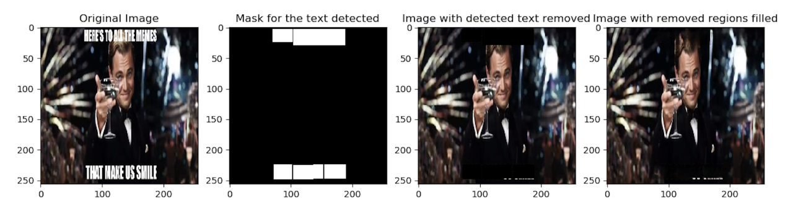
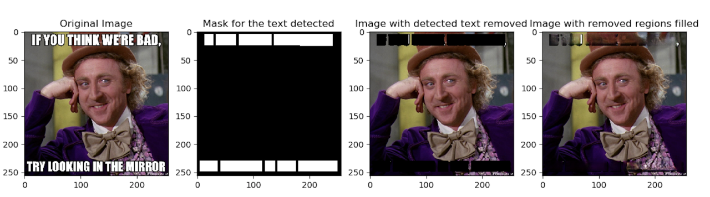

# Meme Image Recovery

Recover the true image of meme image (with text on it). This repo is based on [Generative Image Inpainting with Contextual Attention, CVPR 2018](https://github.com/JiahuiYu/generative_inpainting)

**The Pipeline consists of two stages**:
1. Remove the text regions of the image using [Cloud Vision API](https://cloud.google.com/vision/).
2. Generate image pixels of the removed regions based on the surrounding image pixels using pre-trained image inpainting model from [Generative Image Inpainting with Contextual Attention, CVPR 2018](https://github.com/JiahuiYu/generative_inpainting)

Examples:




## Run

Requirements:
  * Install python3.
  * Install [tensorflow](https://www.tensorflow.org/install/) (tested on Release 1.3.0, 1.4.0, 1.5.0, 1.6.0, 1.7.0).
  * Install tensorflow toolkit [neuralgym](https://github.com/JiahuiYu/neuralgym) (run `pip install git+https://github.com/JiahuiYu/neuralgym`).

Follow instructions from the following link to enable the testing for text removal with Clound Vision API (for text detection): [Cloud Vision API](https://cloud.google.com/vision/docs/quickstart-client-libraries#client-libraries-install-python)

```bash
# Set the environment variable GOOGLE_APPLICATION_CREDENTIALS to the file path of the JSON file that contains your service #account key. 
# This variable only applies to your current shell session, so if you open a new session, set the variable again.
export GOOGLE_APPLICATION_CREDENTIALS=your_json_path
```

Download the pre-trained model dirs from [Generative Image Inpainting with Contextual Attention, CVPR 2018](https://github.com/JiahuiYu/generative_inpainting) ( [CelebA-HQ](https://drive.google.com/open?id=1lpluFXyWDxTY6wcjixQGWX8jxUUMlyBW) | [Places2](https://drive.google.com/open?id=1M3AFy7x9DqXaI-fINSynW7FJSXYROfv-) | [CelebA](https://drive.google.com/open?id=1sP8ViF3mxUMN--xpKqonEeW9d8S8pJEo) | [ImageNet](https://drive.google.com/open?id=136APWSdPRAF7-XoS8sMBTLV-X3f-ogE0) )  and put it under `model_logs/` (rename `checkpoint.txt` to `checkpoint` because google drive automatically add ext after download). All models are trained with images of resolution 256x256 and largest hole size 128x128, above which the results may be deteriorated. 
Please run:

```bash
# python test.py --image your_meme_image_path --output examples/your_output_image_path --chekpoint_dir model_logs/pretrained_model_dir
python test.py --image examples/meme/dicaprio3-583e33155f9b58d5b19e3a00.jpg --output examples/output.png --checkpoint_dir model_logs/release_celeba_256/
```


